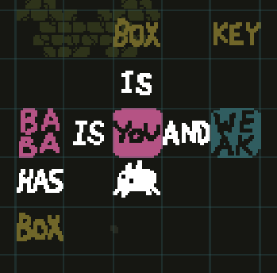
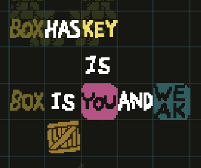
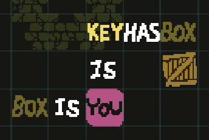

# key points

# method of solve
1) setup the rules `box is you` vertically, `baba is you and weak` horizontally, and `baba has box`

2) destroy `baba`
3) setup the rule `key is you` vertically, `box has key` horizontally, and `box is you and weak` horizontally
 
4) destroy the `box`
5) form the rule `key has box` horizontally, and `box is you` horizontally
 
6) open the `door`
7) touch the `flag`

