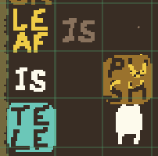

# key points
* we can use `tele`porting objects as method of moving otherwise non-mobile objects around the map
# method of solve
1) push the `rock` into the `foliage`, destroying both
2) form the rule `leaf is tele` and `leaf is push` in way where you form the `leaf is push` rule while entering the `leaf` object and moving upwards

3) Push the `leaf` into the `key`
4) Every second turn, you can push the `leaf` towards the `ghost`. Push it next to the `ghost`
5) When the `leaf` and the `key` are overlapping, push the `leaf` off of the `key`
6) Push the `ghost` onto the `key`, destroying both and revealing the `flag`
